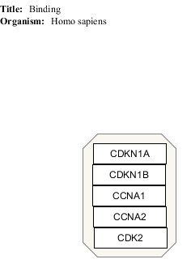
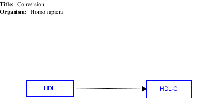
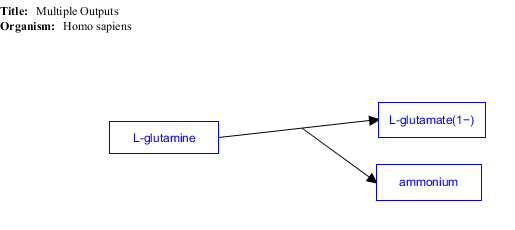
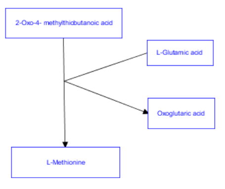
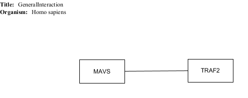
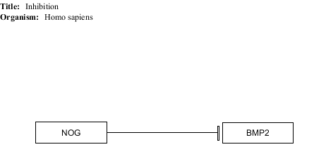

# WikiPathways Interaction Types

## Catalysis

* [GPML](catalysis/Catalysis.gpml)
* [Expected results](catalysis/Catalysis.props)

## Complex binding

* [GPML](complexbinding/ComplexBinding.gpml)
* [Expected results](complexbinding/ComplexBinding.props)

## Conversion

* [GPML](conversion/Conversion.gpml)
* [Expected results](conversion/Conversion.props)

### with multiple outputs

* [GPML](multipleouts/MultipleOutputs.gpml)
* [Expected results](multipleouts/MultipleOutputs.props)

### with multiple inputs and outputs

* [GPML](MultipleInsOuts/multipleInsAndOuts.gpml)
* [Expected results](MultipleInsOuts/multipleInsAndOuts.props)

## General interaction

* [GPML](generalint/GeneralInt.gpml)
* [Expected results](generalint/GeneralInt.props)

## Inhibition

* [GPML](inhibition/Inhibition.gpml)
* [Expected results](inhibition/Inhibition.props)

## Stimulation

* [GPML](stimulation/Stimulation.gpml)
* [Expected results](stimulation/Stimulation.props)

## TranscriptionTranslation

* [GPML](transcriptiontranslation/TranscriptionTranslation.gpml)
* [Expected results](transcriptiontranslation/TranscriptionTranslation.props)

