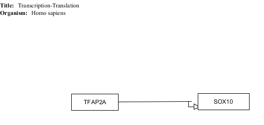
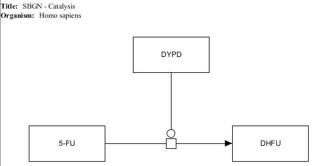
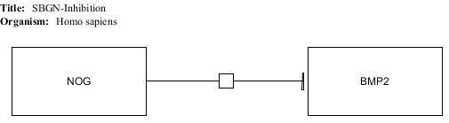
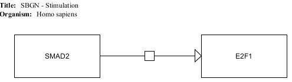

# WikiPathways Interaction Types

## Catalysis

* [GPML](catalysis/Catalysis.gpml)
* [Expected results](catalysis/Catalysis.props)

## Complex binding

* [GPML](complexbinding/ComplexBinding.gpml)
* [Expected results](complexbinding/ComplexBinding.props)

## Conversion

* [GPML](conversion/Conversion.gpml)
* [Expected results](conversion/Conversion.props)

### with multiple outputs

* [GPML](multipleouts/MultipleOutputs.gpml)
* [Expected results](multipleouts/MultipleOutputs.props)

### with multiple inputs and outputs

* [GPML](MultipleInsOuts/multipleInsAndOuts.gpml)
* [Expected results](MultipleInsOuts/multipleInsAndOuts.props)

## Directed interaction (unspecified type)

* [GPML](unspecified/UnspecifiedDirected.gpml)
* [Expected results](unspecified/UnspecifiedDirected.props)

## General interaction

* [GPML](generalint/GeneralInt.gpml)
* [Expected results](generalint/GeneralInt.props)

## Inhibition

* [GPML](inhibition/Inhibition.gpml)
* [Expected results](inhibition/Inhibition.props)

## Stimulation

* [GPML](stimulation/Stimulation.gpml)
* [Expected results](stimulation/Stimulation.props)

## TranscriptionTranslation

* [GPML](transcriptiontranslation/TranscriptionTranslation.gpml)
* [Expected results](transcriptiontranslation/TranscriptionTranslation.props)

## MIM-Catalysis

* [GPML](mim-catalysis/mim-catalysis.gpml)
* [Expected results](mim-catalysis/mim-catalysis.props)

## MIM-Conversion

* [GPML](mim-conversion/mim-conversion.gpml)
* [Expected results](mim-conversion/mim-conversion.props)

## MIM-Inhibition

* [GPML](mim-inhibition/mim-inhibition.gpml)
* [Expected results](mim-inhibition/mim-inhibition.props)

## MIM-Stimulation

* [GPML](mim-stimulation/mim-stimulation.gpml)
* [Expected results](mim-stimulation/mim-stimulation.props)

## SBGN-Catalysis

* [GPML](sbgn-catalysis/sbgn-catalysis.gpml)
* [Expected results](sbgn-catalysis/sbgn-catalysis.props)

## SBGN-Conversion

* [GPML](sbgn-conversion/sbgn-conversion.gpml)
* [Expected results](sbgn-conversion/sbgn-conversion.props)

## SBGN-Inhibition

* [GPML](sbgn-inhibition/sbgn-inhibition.gpml)
* [Expected results](sbgn-inhibition/sbgn-inhibition.props)

## SBGN-Stimulation

* [GPML](sbgn-stimulation/sbgn-stimulation.gpml)
* [Expected results](sbgn-stimulation/sbgn-stimulation.props)
